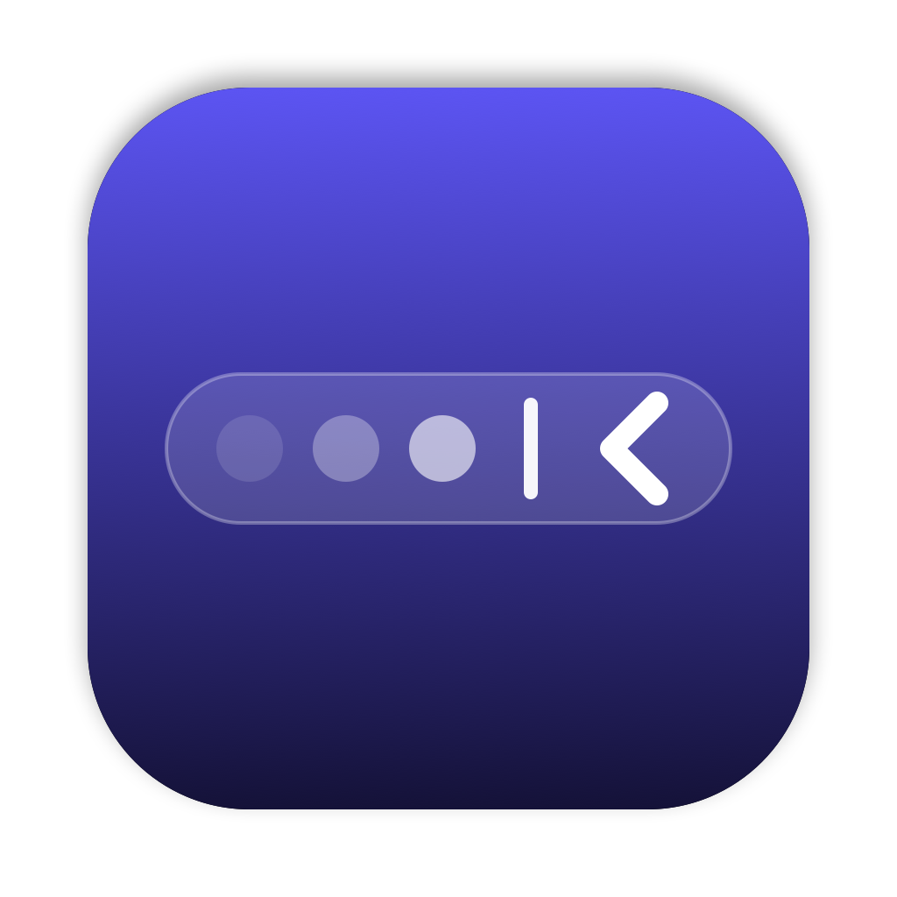

<p align="center">
  
</p>

<h1 align="center">HiddenBar</h1>

<p align="center">
  Cache les icônes superflues de ta barre des menus macOS en un clic.<br>
  Léger, natif (Swift / AppKit), sans dépendance — et compatible macOS 27.
</p>

---

## Installation

### Homebrew

```sh
brew install --cask noahsmo/tap/hiddenbar
```

### Manuelle

1. Télécharge `HiddenBar-x.y.z.zip` depuis les [Releases](https://github.com/NoahSmo/HiddenBar/releases).
2. Décompresse et glisse `HiddenBar.app` dans `/Applications`.
3. L'app n'est pas notarisée par Apple : au premier lancement, fais **clic droit → Ouvrir**, ou :
   ```sh
   xattr -dr com.apple.quarantine /Applications/HiddenBar.app
   ```

## Utilisation

Deux éléments apparaissent dans la barre des menus :

| Élément | Rôle |
|---|---|
| `‹` / `›` chevron | Clic gauche : cacher / afficher. Clic droit : menu (lancer au démarrage, quitter). |
| `\|` séparateur | Tout ce qui est **à sa gauche** est caché. Visible uniquement quand la barre est dépliée. |

**Choisir les icônes à cacher :** maintiens <kbd>⌘</kbd> et glisse une icône à gauche du `|`.

La disposition est mémorisée par macOS : au prochain lancement, les mêmes icônes restent cachées.

> ⚠️ Lance toujours l'app depuis `/Applications`. Sur macOS 27, la position des icônes est mémorisée **par emplacement d'app** : une copie lancée depuis un autre dossier repart de zéro.

## Comment ça marche

HiddenBar crée deux `NSStatusItem` : le chevron et le séparateur. Pour cacher, le séparateur s'élargit jusqu'à repousser les icônes situées à sa gauche.

- **macOS ≤ 26** — le séparateur passe à 10 000 pt et pousse les icônes hors de l'écran (technique classique de Hidden Bar).
- **macOS 27** — la barre est dessinée par le process système `MenuBarAgent`, qui se comporte différemment :
  - un élément plus large que la moitié de l'écran est ignoré (10 000 pt ne fait donc plus rien) ;
  - un élément qui ne tient pas est retiré **avec tous ceux à sa gauche**.

  HiddenBar règle donc le séparateur juste sous la moitié de l'écran : il déborde, et `MenuBarAgent` retire le séparateur et les icônes à cacher, tandis que le chevron reste.

Un garde-fou empêche de replier si le séparateur est placé à droite du chevron (sinon le chevron serait caché avec le reste).

## Compiler depuis les sources

Prérequis : Xcode 15+ (Swift 5.9), macOS 13+.

```sh
git clone https://github.com/NoahSmo/HiddenBar.git
cd HiddenBar
./build.sh            # compile, installe dans /Applications et lance
./build.sh --release  # compile et produit build/HiddenBar-x.y.z.zip (+ sha256)
```

L'icône est générée par code :

```sh
swift tools/make-icon.swift     # → Resources/AppIcon.icns + AppIcon.png
swift tools/make-social.swift   # → docs/social-preview.png (aperçu GitHub, 1280 × 640)
```

### Structure

```
Sources/HiddenBar/
├── main.swift                 # point d'entrée, app sans icône dans le Dock
├── AppDelegate.swift
└── StatusBarController.swift  # chevron, séparateur, logique cacher/afficher
tools/make-icon.swift          # génération de l'icône
tools/make-social.swift        # image d'aperçu du dépôt
build.sh                       # build universel (arm64 + x86_64) + bundle .app
```

## Licence

[MIT](LICENSE)
